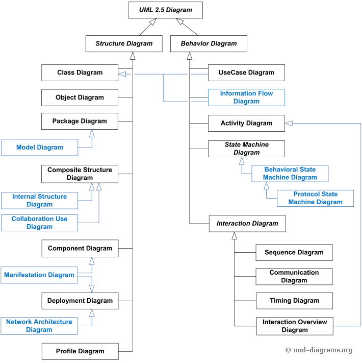
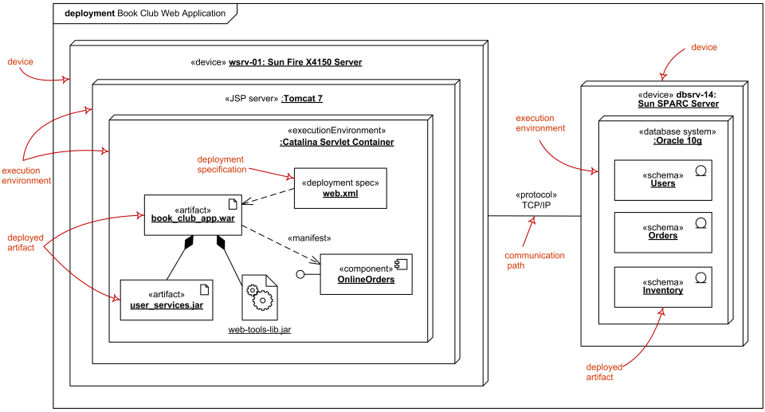
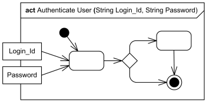

# Course Checkpoint 12


## ¿Qué significa UML? ¿Por qué utilizamos UML?

Si tiene antecedentes en la codificación, probablemente esté familiarizado con los diagramas de UML. ¿Por qué? Debido a que normalmente, los desarrolladores de software utilizan diagramas UML para crear nuevos sistemas. Pero en el mundo de hoy, no se limitan a una sola capacidad. De hecho, los diagramas UML se utilizan ampliamente en diferentes áreas de negocio.

Así que si usted es un gerente de negocio o un desarrollador de software, una comprensión de los diagramas de UML puede ir un largo camino. Siempre es útil actualizar la memoria y familiarizarse con las mejores prácticas para la diagramación UML.

### ¿Por qué se desarrolló UML?

El lenguaje de modelado unificado (UML) es un lenguaje de modelado estandarizado. Ayuda a los desarrolladores de software a visualizar, construir y documentar nuevos sistemas de software y planos.

UML se utiliza para crear diagramas de estructura estática basados en una variedad de prácticas de ingeniería que han demostrado ser exitosas en la creación de sistemas complejos. Las normas publicadas tienen casi 800 páginas.

Históricamente, UML se ha utilizado para modelar sistemas de software, pero no se limita a los desarrolladores de software. Hoy en día, los diagramas UML también se utilizan para administrar procesos y proyectos. En este escenario, los diagramas de UML describen flujos de trabajo y procesos empresariales completos.

UML fue creado en 1995 por Grady Booch, Ivar Jacobson y James Rumbaugh. En 1997, el Grupo de Gestión de Objetos adoptó UML, lo que significa que se lanzó a empresas como Hewlett-Packard, Apple e IBM.

En 2005, la Organización Internacional de Normalización (ISO) lo estandarizó. Se ha revisado y revisado constantemente desde entonces, con la última especificación de UML que tiene lugar en 2015.


UML se creó como un lenguaje de modelado claro para que los desarrolladores lo usen. Fue diseñado para ser simple y fácil de entender para que todos pudieran seguir el proceso y diseño del software.

Hoy en día, no es sólo utilizado por los desarrolladores de software. Es un enfoque más utilizado para estructuras de aplicaciones y modelado, así como para documentar software.

### ¿Qué es un diagrama de UML?

Para los desarrolladores de software, mantenerse al tanto de las jerarquías y relaciones dentro de un sistema puede ser difícil, especialmente cuando se enfoca en áreas complejas y detalladas de código.

Pero el uso de un modelo UML divide estos sistemas en componentes y subcomponentes. Esto facilita la visualización, planificación y ejecución de su proyecto.

Para los analistas de negocios, un diagrama de UML les ayuda a visualizar el sistema o proceso en el que están trabajando.


### ¿Cuándo debe utilizar un diagrama UML?

Lo más común es que un diagrama de UML se utilice para analizar software existente, modelar software nuevo y planificar el desarrollo de software y la priorización. En pocas palabras, si usted necesita una manera de visualizar y planificar su proceso de desarrollo de software, un diagrama de UML es increíblemente útil.

Para la administración empresarial, un diagrama de UML ayuda a los equipos a organizar su lugar de trabajo, crear documentación de procesos y optimizar su flujo de trabajo.

También pueden utilizarse para actualizar a las partes interesadas sobre las operaciones comerciales y el progreso. Y si está utilizando una plataforma colaborativa, puede invitar fácilmente a colaboradores externos y a partes interesadas a ver el diagrama.

### Las ventajas de utilizar un diagrama de uml

Ahora que sabemos qué es un diagrama de UML y para qué se utiliza, echemos un vistazo a algunos de los beneficios de usarlo.

#### Mantener a todos en la misma página

UML es un lenguaje estandarizado. Cada elemento UML significa lo mismo sin importar qué negocio los esté usando y para qué sirve el diagrama.

Por ejemplo, el icono «actor» representa a un usuario. Esto podría ser un cliente, alguien del equipo interno, u otro sistema que interactúe con el tema del diagrama (en este caso, sería su software).

Este icono siempre se presenta como una figura de palo. Cada vez que alguien vea este icono, sabrá automáticamente lo que significa en el contexto de su diagrama.


Así que cuando se trata de crear un diagrama UML, los símbolos estandarizados hacen que sea más fácil para todos entender el diagrama. No hay confusión sobre lo que significan ciertos iconos, y todo el mundo sabe cómo leer un diagrama de UML con eficacia.

#### Explorar diferentes opciones

Implementar software nuevo o actualizar uno existente puede ser un proceso costoso y lento. Por esta razón, no siempre es posible probar diferentes versiones del software para ver qué funciona mejor.

Aquí es donde un diagrama de UML puede ayudar.

Antes de iniciar el nuevo software, puede utilizar el diagrama para probar diferentes estructuras. Como resultado, puede realizar cambios y mejoras antes de iniciar el software. Esto te ahorra tiempo y dinero a largo plazo.

#### Tener una documentación clara del flujo de trabajo

Al utilizar un diagrama UML, podrá documentar los nuevos procesos de software o de negocio. Esto significa que puede realizar un seguimiento del progreso con el tiempo, asegurarse de que las cosas van a planificarse e identificar áreas clave de mejora.

Supongamos que ha utilizado un diagrama de UML para planificar un nuevo proceso de negocio. El proceso se ha implementado en su equipo, y están siguiendo los nuevos pasos.

Pero algo no está bien. El proceso no mueve su flujo de trabajo tan rápido como esperaba. Para identificar lo que está causando el retraso, consulte el diagrama de UML y señale la raíz del problema. Y una vez que hayas encontrado el problema, puedes arreglar las cosas.

## UML

Un diagrama UML es una representación gráfica parcial (vista) de un modelo de un sistema bajo diseño, implementación o ya existente. El diagrama UML contiene elementos gráficos (símbolos) - nodos UML conectados con aristas (también conocidos como rutas o flujos) - que representan elementos en el modelo UML del sistema diseñado. El modelo UML del sistema también podría contener otra documentación, como casos de uso escritos como textos templados.

El tipo de diagrama está definido por los símbolos gráficos primarios mostrados en el diagrama. Por ejemplo, un diagrama donde los símbolos primarios del área de contenido son clases es un diagrama de clases. Un diagrama que muestra casos de uso y actores es un diagrama de caso de uso. Un diagrama de secuencia muestra la secuencia de intercambios de mensajes entre líneas de vida.

La especificación UML no excluye la mezcla de diferentes tipos de diagramas, por ejemplo, para combinar elementos estructurales y conductuales para mostrar una máquina de estado anidada dentro de un caso de uso. En consecuencia, los límites entre los distintos tipos de diagramas no se aplican estrictamente. Al mismo tiempo, algunas herramientas de UML restringen el conjunto de elementos gráficos disponibles que podrían utilizarse cuando se trabaja en un tipo específico de diagrama.

### Clasificación de la UML

La especificación UML define dos tipos principales de diagrama UML: diagramas de estructura y diagramas de comportamiento.

Los diagramas de estructura muestran la estructura estática del sistema y sus partes en diferentes niveles de abstracción e implementación y cómo están relacionados entre sí. Los elementos de un diagrama de estructura representan los conceptos significativos de un sistema, y pueden incluir conceptos abstractos, del mundo real y de implementación.

Los diagramas de comportamiento muestran el comportamiento dinámico de los objetos de un sistema, que se puede describir como una serie de cambios en el sistema a lo largo del tiempo.

Los diagramas UML 2.5 se pueden clasificar jerárquicamente como se muestra a continuación. Nota: los elementos mostrados en azul no forman parte de la taxonomía oficial UML 2.5 de los diagramas.



Descripción general de los diagramas UML 2.5.

Nota: los elementos en azul no forman parte de la taxonomía oficial de los diagramas UML 2.5

## Nombra y explica los diagramas estructurales

Los diagramas de estructura muestran la estructura estática del sistema y sus piezas en diferentes niveles de abstracción e implementación y cómo esas piezas están relacionadas entre sí. Los elementos de un diagrama de estructura representan los conceptos significativos de un sistema, y pueden incluir conceptos abstractos, del mundo real y de implementación.

Los diagramas de estructura no utilizan conceptos relacionados con el tiempo, no muestran los detalles del comportamiento dinámico. Sin embargo, pueden mostrar relaciones con los comportamientos de los clasificadores expuestos en los diagramas de estructura.

### Diagrama de clases

El diagrama de clase es un diagrama de estructura UML que muestra la estructura del sistema diseñado a nivel de clases e interfaces, muestra sus características, restricciones y relaciones - asociaciones, generalizaciones, dependencias, etc.

Algunos tipos comunes de diagramas de clase son:

- diagrama de modelo de dominio,
- diagrama de clases de implementación.

El diagrama de objetos puede considerarse como un diagrama de clase de nivel de instancia que muestra especificaciones de instancia de clases e interfaces (objetos), ranuras con especificaciones de valor y enlaces (instancias de asociación).

#### Diagrama del modelo de dominio


Descripción general del diagrama de dominio - clases, interfaces, asociaciones, uso, realización, multiplicidad.

#### Diagrama de clases de implementación


Elementos del diagrama de clases de implementación - clases, interfaces, asociaciones, uso, realización.

### Diagrama de paquetes

El diagrama de paquete es un diagrama de estructura UML que muestra la estructura del sistema diseñado a nivel de paquetes. Los siguientes elementos se dibujan normalmente en un diagrama de paquetes: paquete, elemento empaquetable, dependencia, importación de elementos, importación de paquetes, combinación de paquetes.

#### Diagrama de paquetes

Algunos elementos principales del diagrama del paquete se muestran en el siguiente plano. Compras web, compras móviles, compras telefónicas y paquetes de compras por correo combinan el paquete del carro de la compra. Los mismos 4 paquetes utilizan Paquete de pago. Tanto los paquetes de pago como el carro de la compra importan otros paquetes.


Elementos del diagrama de paquetes UML: paquete, importación, acceso, uso, combinación.

#### Diagrama de modelo

El diagrama de modelo es un diagrama de estructura auxiliar de UML que muestra alguna abstracción o vista específica de un sistema, para describir algunos aspectos arquitectónicos, lógicos o conductuales del sistema.

El siguiente dibujo muestra algunos elementos principales del diagrama del modelo. Aplicación en capas es un modelo «contenedor» que contiene otros tres modelos: Capa de presentación, Capa de negocio y Capa de datos. Hay dependencias definidas entre estos modelos contenidos.


Elementos de diagrama de modelo UML: modelo, paquete, dependencia.

#### Diagramas de estructura compuesta

El diagrama de estructura compuesta se puede utilizar para mostrar:

- estructura interna de un clasificador - diagrama de estructura interna,
- interacciones de clasificadores con el entorno a través de puertos,
- un comportamiento de un diagrama de uso de colaboración.

El término «estructura» para este tipo de diagramas se define en UML como una composición de elementos interconectados, representando instancias en tiempo de ejecución que colaboran a través de enlaces de comunicaciones para alcanzar algunos objetivos comunes.

##### Internal Structure Diagrams

El diagrama de estructura interna muestra la estructura interna de un clasificador - una descomposición de ese clasificador en sus propiedades, piezas y relaciones.

Los siguientes elementos gráficos se dibujan normalmente en un diagrama de estructura compuesta que muestra la estructura interna de un clasificador: clase, pieza, puerto, conector, uso.


Descripción general del diagrama de estructura compuesta muestra elementos de la estructura interna del clasificador estructurado - roles, piezas, conectores.

##### Diagramas de uso de colaboración

El comportamiento del sistema es la funcionalidad que el sistema bajo diseño implementará o que ya está implementado por algún sistema existente. Los objetos de un sistema suelen cooperar entre sí para producir el comportamiento de un sistema.

Un comportamiento de una colaboración eventualmente será exhibido por un conjunto de instancias cooperantes (especificadas por clasificadores) que se comunican entre sí enviando señales o invocando operaciones. Sin embargo, para entender los mecanismos utilizados en un diseño, puede ser importante describir sólo los aspectos de estos clasificadores y sus interacciones que están involucrados en la realización de una tarea o un conjunto de tareas relacionadas, proyectados a partir de estos clasificadores.

Las colaboraciones permiten describir únicamente los aspectos relevantes de la cooperación de un conjunto de instancias, identificando los roles específicos que las instancias desempeñarán.

Las interfaces permiten especificar las propiedades observables externamente de una instancia sin determinar el clasificador que se utilizará para especificar esta instancia. Consecuentemente, los roles en una colaboración a menudo serán escritos por interfaces y luego prescribirán propiedades que las instancias participantes deben exhibir, pero no determinarán qué clase especificará las instancias participantes.

Los siguientes nodos y bordes se dibujan normalmente en un diagrama de estructura compuesta que muestra el comportamiento de una colaboración: colaboración, conector, pieza, especialización de colaboración, dependencia.


El uso de colaboración representa un uso particular (ocurrencia) o la aplicación del patrón descrito por una colaboración a una situación específica que involucra clases o instancias específicas que desempeñan los roles de la colaboración. Un uso de colaboración muestra cómo se aplica el patrón descrito por una colaboración en un contexto determinado, vinculando entidades específicas de ese contexto a los roles de la colaboración.


La colaboración utiliza elementos: roles, piezas, enlace de roles.
Uso de colaboración childVisit representa un uso en particular
de la colaboración Visita.

Clasificador (en estructuras internas y colaboraciones) se amplía con la capacidad de propios usos de colaboración. Estos usos de colaboración enlazan una colaboración con el clasificador para dar una descripción del comportamiento del clasificador.

Uno de los usos de colaboración que posee el clasificador puede seleccionarse como representación del comportamiento del clasificador en su conjunto. La colaboración relacionada con el clasificador por este uso de colaboración muestra cómo las instancias correspondientes a las características estructurales de este clasificador (por ejemplo, sus atributos y partes) interactúan para generar el comportamiento general del clasificador.

La colaboración representativa puede utilizarse para proporcionar una descripción del comportamiento del clasificador en un nivel de abstracción diferente al que ofrece la estructura interna del clasificador. Las propiedades del clasificador se asignan a roles en la colaboración mediante los enlaces de rol del uso de colaboración.

### Diagramas de componentes

El diagrama de componentes muestra los componentes, las interfaces proporcionadas y requeridas, los puertos y las relaciones entre ellos. Este tipo de diagramas se utiliza en Desarrollo basado en componentes (CBD) para describir sistemas con arquitectura orientada a servicios (SOA).

El desarrollo basado en componentes se basa en supuestos de que los componentes construidos anteriormente podrían reutilizarse y que los componentes podrían reemplazarse por otros componentes «equivalentes» o «conformes», si fuera necesario.

Los artefactos que implementan el componente pretenden ser capaces de ser desplegados y re-desplegados independientemente, por ejemplo para actualizar un sistema existente.

Los componentes de UML podrían representar

- componentes lógicos (por ejemplo, componentes empresariales, componentes de proceso) y
- componentes físicos (por ejemplo, componentes CORBA, componentes EJB, componentes COM + y .NET, componentes WSDL, etc.),

junto con los artefactos que los implementan y los nodos en los que se despliegan y ejecutan. Se prevé que se elaborarán perfiles basados en componentes específicos para tecnologías de componentes y entornos de hardware y software asociados.

Los siguientes nodos y bordes se dibujan normalmente en un diagrama de componentes: componente, interfaz, interfaz proporcionada, interfaz requerida, clase, puerto, conector, artefacto, realización de componentes, dependencia, uso. Estos elementos principales se muestran en la siguiente imagen.


Los elementos principales del diagrama de componentes UML - componente, interfaz proporcionada, interfaz requerida, puerto, conectores.

### Diagramas de implementación

El diagrama de implementación es un diagrama de estructura que muestra la arquitectura del sistema como implementación (distribución) de artefactos de software a destinos de implementación.

Los artefactos representan elementos concretos en el mundo físico que son el resultado de un proceso de desarrollo. Ejemplos de artefactos son archivos ejecutables, bibliotecas, archivos, esquemas de bases de datos, archivos de configuración, etc.

El destino de implementación suele estar representado por un nodo que es un dispositivo de hardware o algún entorno de ejecución de software. Los nodos podrían conectarse a través de rutas de comunicación para crear sistemas en red de complejidad arbitraria.

Tenga en cuenta que los componentes se implementaron directamente en los nodos de los diagramas de despliegue de UML 1.x. En UML 2.x los artefactos se implementan en nodos y los artefactos pueden manifestar (implementar) componentes. Los componentes se implementan en nodos indirectamente a través de artefactos.

Los diagramas de implementación podrían describir la arquitectura a nivel de especificación (también llamado nivel de tipo) o a nivel de instancia (similar a los diagramas de clase y los diagramas de objeto).

El diagrama de implementación de nivel de especificación muestra una visión general de la implementación de artefactos en destinos de despliegue, sin hacer referencia a instancias específicas de artefactos o nodos.

El diagrama de despliegue de nivel de instancia muestra la implementación de instancias de artefactos en instancias específicas de destinos de despliegue. Podría utilizarse, por ejemplo, para mostrar diferencias en las implementaciones en entornos de desarrollo, estadificación o producción con los nombres/ids de servidores o dispositivos específicos de compilación o implementación.

Algunos tipos comunes de diagramas de implementación son:

- Implementación (manifestación) de componentes por artefactos,
- Diagrama de implementación de nivel de especificación,
- Diagrama de implementación de nivel de instancia,
- Arquitectura de red del sistema.

#### Manifestación de componentes por artefactos

Mientras que los diagramas de componentes muestran componentes y relaciones entre componentes y clasificadores, y diagramas de despliegue: despliegues de artefactos en destinos de despliegue, algún diagrama intermedio que falta es un diagrama de manifestaciones que se utilizará para mostrar manifestación (implementación) de componentes por artefactos y estructura interna de artefactos.

Dado que los diagramas de manifestación no están definidos por la especificación UML 2.4, la manifestación de componentes por artefactos podría mostrarse mediante diagramas de componentes o diagramas de despliegue.


Manifestación de componentes por artefactos.

#### Diagrama de implementación de nivel de especificación

El diagrama de implementación de nivel de especificación (también llamado nivel de tipo) muestra una visión general de la implementación de artefactos en destinos de despliegue, sin hacer referencia a instancias específicas de artefactos o nodos.

Diagrama de implementación de nivel de especificación: aplicación web desplegada en el servidor JSP Tomcat y esquemas de base de datos en el sistema de bases de datos.

#### Diagrama de implementación de nivel de instancia

El diagrama de despliegue de nivel de instancia muestra la implementación de instancias de artefactos en instancias específicas de destinos de despliegue. Podría utilizarse, por ejemplo, para mostrar diferencias en las implementaciones en entornos de desarrollo, estadificación o producción con los nombres/ids de servidores o dispositivos de implementación específicos.

En el ejemplo siguiente, la aplicación web se despliega en el servidor de aplicaciones wsrv-01 y varios esquemas de bases de datos en el servidor de bases de datos dbsrv-14.



Diagrama de despliegue del nivel del caso - aplicación web desplegada a Gato macho servidor de JSP y esquemas de la base de datos - a sistema de la base de datos.

### Diagramas de perfil

El diagrama de perfil es un diagrama de estructura que describe el mecanismo de extensión ligero de la UML definiendo estereotipos personalizados, valores etiquetados y restricciones. Los perfiles permiten la adaptación del metamodelo UML para diferentes:

- plataformas, como Java Platform, Enterprise Edition (Java EE) o Microsoft .NET Framework, o
- dominios, tales modelos de procesos de negocio, arquitectura orientada a servicios, aplicaciones médicas, etc.

Por ejemplo, la semántica de los elementos metamodeles UML estándar podría estar especializada en un perfil. En un modelo con el perfil «modelo Java», la generalización de clases debería poder restringirse a una sola herencia sin tener que asignar explícitamente un estereotipo «clase Java» a todas y cada una de las instancias de clase.

El mecanismo de perfiles no es un mecanismo de extensión de primera clase. No permite modificar metamodelos existentes ni crear un nuevo metamodelo como lo hace MOF. El perfil sólo permite la adaptación o personalización de un metamodelo existente con construcciones específicas para un determinado dominio, plataforma o método. No es posible quitar ninguna de las restricciones que se aplican a un metamodelo, pero es posible añadir nuevas restricciones que son específicas del perfil.

Las personalizaciones de metamodelo se definen en un perfil, que luego se aplica a un paquete. Los estereotipos son metaclases específicas, los valores etiquetados son metaatribuidos estándar y los perfiles son tipos específicos de paquetes.

Los perfiles se pueden aplicar o retraer dinámicamente desde un modelo. También se pueden combinar dinámicamente para que se apliquen varios perfiles al mismo tiempo en el mismo modelo.

Los nodos y bordes gráficos utilizados en los diagramas de perfil son: perfil, metaclase, estereotipo, extensión, referencia, aplicación de perfil.


Elementos principales del diagrama de perfil UML: perfil, estereotipo, metaclase, extensión, aplicación de perfil.

## Nombra y explica los diagramas de comportamiento

### Diagramas de casos de uso

)
Los diagramas de casos de uso suelen denominarse diagramas de comportamiento utilizados para describir un conjunto de acciones (casos de uso) que algunos sistemas (sujeto) deben o pueden realizar en colaboración con uno o más usuarios externos del sistema (actores). Cada caso de uso debe proporcionar algún resultado observable y valioso a los agentes u otras partes interesadas del sistema.

Tenga en cuenta que las especificaciones de UML 2.0 a 2.4 también describieron el diagrama de caso de uso como una especialización de un diagrama de clase, y el diagrama de clase es un diagrama de estructura.

Los diagramas de casos de uso son de hecho dos, ambos son diagramas de comportamiento, porque describen el comportamiento del sistema, y también son diagramas de estructura, como un caso especial de diagramas de clase donde los clasificadores se limitan a ser actores o usar casos relacionados entre sí con asociaciones.

[UML 2.5 FTF - Beta 1] movió los casos de uso fuera del modelado de comportamiento a conceptos suplementarios de UML. Por lo tanto, es un desafortunado dilema qué tipo de diagramas de UML utilizar diagramas de casos son.

#### Diagramas de casos de uso empresariales

Aunque el soporte para el modelado de negocios fue declarado como uno de los objetivos de la UML, la especificación de UML no proporciona notación específica para las necesidades empresariales.

Los casos de uso empresarial se introdujeron en Rational Unified Process (RUP) para representar la función, el proceso o la actividad del negocio modelado. Un actor de negocios representa un papel desempeñado por alguna persona o sistema externo al negocio modelado e interactuando con el negocio. Caso de uso empresarial debe producir un resultado de valor observable para un actor de negocio.

En la siguiente imagen se muestran los principales elementos del diagrama de casos de uso empresarial. Tenga en cuenta de nuevo que tanto el caso de uso empresarial como el actor empresarial no están definidos en el estándar UML, por lo que tendrá que utilizar alguna herramienta UML que los apoye o crear sus propios estereotipos de modelado empresarial.


Principales elementos del diagrama de casos de uso empresarial: actor comercial, caso de uso empresarial,
límite de negocio, incluir y extender las relaciones.

#### Diagramas de casos de uso del sistema

(Sistema) Se utilizan diagramas de casos de uso para especificar:

- requisitos (externos), usos requeridos de un sistema bajo diseño o análisis (sujeto) - para capturar lo que se supone que el sistema debe hacer;
- la funcionalidad ofrecida por un sujeto - lo que el sistema puede hacer;
- requisitos que el sujeto especificado plantea en su entorno - mediante la definición de cómo el entorno debe interactuar con el sujeto para que pueda realizar sus servicios.

Los elementos principales del diagrama de casos de uso de UML se muestran en la imagen siguiente.


Principales elementos del diagrama de casos de uso de UML: actor, caso de uso, sujeto,
incluir y ampliar las relaciones.

### Diagramas de flujo de información

El diagrama de flujo de información es un diagrama de comportamiento UML que muestra el intercambio de información entre entidades del sistema en algunos niveles altos de abstracción. Los flujos de información pueden ser útiles para describir la circulación de información a través de un sistema representando aspectos de modelos aún no especificados o con menos detalles.

Los flujos de información no especifican la naturaleza de la información, los mecanismos por los que se transmite, las secuencias de intercambio o las condiciones de control. Los elementos de información pueden utilizarse para representar la información que fluye a través de un sistema a lo largo de los flujos de información antes de que se hayan diseñado detalles de su realización.


Elementos de diagrama de flujo de información de UML: flujo de información, elemento de información.

### Diagramas de actividad

El diagrama de actividad es un diagrama de comportamiento UML que muestra el flujo de control u flujo de objetos con énfasis en la secuencia y las condiciones del flujo. Las acciones coordinadas por modelos de actividad pueden iniciarse porque otras acciones terminan de ejecutarse, porque los objetos y los datos están disponibles o porque se producen algunos eventos externos al flujo.

Los siguientes nodos y bordes se dibujan normalmente en diagramas de actividad UML: actividad, partición, acción, objeto, control, borde de actividad.

#### Actividad

La actividad es un comportamiento parametrizado representado como flujo coordinado de acciones.

El flujo de ejecución se modela como nodos de actividad conectados por bordes de actividad. Un nodo puede ser la ejecución de un comportamiento subordinado, como un cálculo aritmético, una llamada a una operación o la manipulación del contenido del objeto. Los nodos de actividad también incluyen construcciones de flujo de control, como sincronización, decisión y control de concurrencia. Las actividades pueden formar jerarquías de invocación invocando otras actividades, resolviéndose finalmente a acciones individuales. En un modelo orientado a objetos, las actividades suelen invocarse indirectamente como métodos vinculados a operaciones que se invocan directamente.

La actividad contiene nodos de actividad que podrían ser:

- acción
- objeto
- control

Las actividades pueden contener acciones de diversos tipos:

- Ocurrencias de funciones primitivas, como las funciones aritméticas.
- Invocaciones de comportamiento, como actividades.
- Acciones de comunicación, como el envío de señales.
- Manipulaciones de objetos, como lectura o escritura de atributos o asociaciones.

Hay acciones que invocan actividades, ya sea directamente utilizando la acción de comportamiento de llamada o indirectamente con la acción de operación de llamada.

La actividad se puede representar como rectángulo de esquina redonda con el nombre de la actividad en la esquina superior izquierda y los nodos y bordes de la actividad dentro del borde. Los ejemplos de especificación UML 2.4 muestran el nombre de la actividad en negrita.


Actividad de compras en línea.

Los parámetros de actividad se muestran en el borde y se enumeran debajo del nombre de la actividad como:
nombre-parámetro: tipo-parámetro.


Autenticar la actividad del usuario con dos parámetros: ID de inicio de sesión y contraseña.

Como una actividad de comportamiento podría tener restricciones previas y posteriores a la condición. Si están presentes, se muestran con las palabras clave «precondición» y «postcondición», respectivamente.

La palabra clave «singleExecution» se usa para actividades que ejecutan como una ejecución compartida sola (cosa única), por otra parte, cada invocación ejecuta en su propio espacio.

El borde de actividad de corneado redondo puede reemplazarse por la notación de marco para diagramas. El tipo de marco en este caso es la actividad o actuar en forma corta. Parámetros de actividad si se muestran en el marco.



Autenticar marco de actividad del usuario con dos parámetros: ID de inicio de sesión y contraseña.

La notación para clases con la palabra clave «actividad» se puede utilizar para mostrar las características de una actividad reflexiva, para indicar que es una clase de actividad. La notación de la máquina de asociación y de estado también se puede utilizar según sea necesario.

UML permite que los comportamientos produzcan tokens que son actividades y que a su vez pueden ejecutarse en tiempo de ejecución.

#### Partición de actividad

Una partición de actividad es un grupo de actividades para acciones que tienen alguna característica común.

Las particiones a menudo corresponden a unidades organizativas o actores empresariales en un modelo de negocio.

Las particiones proporcionan una vista restringida de los comportamientos invocados en las actividades. Las restricciones se pueden seleccionar según el tipo de elemento que represente la partición. Las siguientes restricciones son normativas (estándar) en UML 2.4:

- clasificador
- caso
- parte
- atributo y valor

Por ejemplo, las particiones podrían representar clasificadores específicos. En este caso, las acciones en cada partición deben ser operaciones o señales dirigidas a objetos que son instancias del clasificador correspondiente.

Una partición puede representar algún atributo y sus subparticiones - valores específicos de ese atributo. Por ejemplo, una partición puede representar la ubicación en la que se lleva a cabo un comportamiento y las subparticiones representarían valores específicos para ese atributo, como Nueva York.

La partición de actividad se puede mostrar usando una notación de plano de baño - con dos líneas, generalmente paralelas, ya sea horizontal o vertical, y un nombre etiquetando la partición en un cuadro en un extremo. Los nodos de actividad, por ejemplo, las acciones y los bordes colocados entre estas líneas se consideran contenidos en la partición.


Particiones de actividad Cliente y Departamento de Pedidos como pistas de baño horizontales


Particiones de actividad Cliente y Departamento de Pedidos como pistas de baño verticales

La partición jerárquica se representa utilizando los canales de baño para subparticiones como se ilustra a continuación.


Partición jerárquica con subparticiones

Una partición puede marcarse como una cota para que sus subparticiones contengan (agrupen) esas subparticiones a lo largo de la cota. Por ejemplo, una actividad puede tener una dimensión de particiones para la ubicación en la que se llevan a cabo los comportamientos contenidos y otra para el costo de realizarlos. Ninguna otra partición puede contener particiones de dimensión.

Los diagramas también se pueden particionar multidimensionalmente, donde cada célula de natación es una intersección de múltiples particiones. Las particiones dentro de cada dimensión pueden agruparse en una partición de actividad adjunta con isDimension = true, cuyo nombre es el nombre de dimensión. Sin embargo, en lugar de mostrarse como una partición misma, la cota se indica colocando su nombre junto al conjunto de particiones de la cota.

La partición podría representar una entidad externa a la que no se aplica la estructura de partición. Las particiones externas son excepciones intencionales a las reglas de la estructura de particiones. Por ejemplo, una cota puede tener particiones que muestren partes de un clasificador estructurado. Puede tener una partición externa que no represente una de las piezas, sino un clasificador completamente separado. En el modelado de negocios, las particiones externas se pueden utilizar para modelar entidades fuera de un negocio.

Cuando se considera que las actividades ocurren fuera del dominio de un modelo en particular, la partición se puede etiquetar con la palabra clave «externa». Siempre que una actividad en un avión de baño está marcada como «externa», esto anula la designación del avión de baño y la dimensión.


La acción de compra se produce en la partición externa Cliente

### Diagramas de máquinas de estado

Diagrama de máquina de estado es un diagrama de comportamiento que muestra el comportamiento discreto de una parte del sistema diseñado a través de transiciones de estado finito. Los diagramas de máquinas de estado también se pueden utilizar para expresar el protocolo de uso de una parte de un sistema. Dos tipos de máquinas de estado definidas en UML 2.4 son

- máquina de estado conductual, y
- máquina de estado de protocolo.

Los siguientes nodos y bordes se dibujan normalmente en el diagrama de máquina de estado: estado de comportamiento, transición de comportamiento, estado de protocolo, transición de protocolo, pseudostatos diferentes.

#### Máquina de estado conductual

La máquina de estado conductual es la especialización del comportamiento y se utiliza para especificar el comportamiento discreto de una parte del sistema diseñado a través de transiciones de estado finito. El formalismo de máquina de estado utilizado en este caso es una variante basada en objetos de Harel statecharts.

El comportamiento se modela como un traversal de un gráfico de nodos de estado conectados con transiciones. Las transiciones son activadas por el envío de series de eventos. Durante el recorrido, la máquina estatal también podía ejecutar algunas actividades.

Máquina de estado conductual podría ser propiedad de clasificador de comportamiento que se llama su contexto. El contexto define qué disparadores de señal y llamada se definen para esta máquina de estado y qué atributos y operaciones están disponibles en las actividades de la máquina de estado. Los disparadores de señal y los disparadores de llamada para la máquina de estado se definen según las recepciones y operaciones de este clasificador.

La máquina de estado puede tener una característica conductual asociada (especificación) y ser el método de esta característica conductual. En este caso, la máquina de estado especifica el comportamiento de esta característica de comportamiento. Los parámetros de la máquina de estado coinciden con los parámetros de la característica de comportamiento y proporcionan los medios para acceder a los parámetros de característica de comportamiento dentro de la máquina de estado.

El grupo de eventos de la máquina de estado es el grupo de eventos de la instancia según el clasificador de contexto de comportamiento o el clasificador que posee la característica de comportamiento para la que la máquina de estado es un método.

El clasificador de contexto de la máquina de estado de método de una característica conductual debe ser el clasificador que posee la característica conductual. Una máquina de estado sin un clasificador de contexto puede utilizar desencadenadores que sean independientes de las recepciones u operaciones de un clasificador, es decir, sólo disparadores de señal o disparadores de llamada basados en parámetros de plantilla de operación de la máquina de estado (parametrizada).

La asociación entre una máquina de estado y su clasificador de contexto o característica de comportamiento no tiene una notación especial.

La máquina de estado se puede representar en el marco etiquetado como máquina de estado o stm en forma abreviada. (Tenga en cuenta que, por cualquier razón, todos los ejemplos de fotogramas de máquinas de estado del capítulo 15 de la especificación UML 2.4 no tienen especificado este tipo de trama.) El área de contenido de la trama suele ser la propia máquina de estado, pero en general podría contener otros tipos de diagramas UML.


Máquina de estado conductual de alto nivel para cajero automático bancario

La máquina de estado de comportamiento es subclasificada por la máquina de estado de protocolo.

##### vértice

Vértice recibe el nombre de elemento que es una abstracción de un nodo en un gráfico de máquina de estado. En general, puede ser el origen o destino de cualquier número de transiciones.

Las subclases de vértice son:

- estado
- pseudoestado

Estado es un vértice que modela una situación durante la cual se mantiene alguna condición invariante (generalmente implícita).

##### Estado de comportamiento

El estado en máquinas de estado conductual modela una situación durante la cual se mantiene alguna condición invariante (generalmente implícita). El invariante puede representar una situación estática como un objeto esperando a que ocurra algún evento externo. Sin embargo, también puede modelar condiciones dinámicas como el proceso de realizar algún comportamiento (es decir, el elemento modelo bajo consideración entra en el estado cuando el comportamiento comienza y lo deja tan pronto como se completa el comportamiento).

Los estados heredados se dibujan con líneas con guiones o líneas con tonos grises.

La UML define los siguientes tipos de estados:

- estado simple,
- estado compuesto,
- estado submachine.

###### Estado simple

Un estado simple es un estado que no tiene subestados - no tiene regiones y no tiene estados submachine.

El estado simple se muestra como un rectángulo con esquinas redondeadas y el nombre del estado dentro del rectángulo.


Estado simple esperando la entrada del cliente.

Opcionalmente, el estado puede tener el nombre de estado colocado dentro de una ficha de nombre adjunta. La ficha de nombre es un rectángulo, que normalmente descansa en el exterior del lado superior de un estado.

El estado simple puede tener compartimentos. Los compartimentos del estado son:

- compartimiento de nombres
- compartimiento de actividades internas
- compartimiento de transiciones internas

El compartimento de nombres contiene el nombre (opcional) del estado, como una cadena. Los estados sin nombres se llaman estados anónimos y se consideran estados distintos (diferentes). Los compartimentos de nombres no deben utilizarse si se utiliza una ficha de nombres y viceversa. Se recomienda no utilizar el mismo nombre varias veces en el mismo diagrama.

El compartimento de actividades internas contiene una lista de acciones internas o actividades de estado (do) (comportamientos) que se realizan mientras el elemento está en el estado. La etiqueta de actividad identifica las circunstancias en las que se invocará el comportamiento especificado por la expresión de actividad. La expresión de comportamiento puede utilizar cualquier atributo y extremo de asociación que se encuentre en el ámbito de la entidad propietaria. Para los elementos de lista donde la expresión está vacía, el separador de barras diagonales es opcional.

Varias etiquetas están reservadas para fines especiales y no se pueden utilizar como nombres de eventos. Las siguientes son las etiquetas de actividad reservadas:

- entrada (comportamiento realizado al entrar al estado)
- do (comportamiento continuo, realizado siempre y cuando el elemento esté en el estado)
- salida (comportamiento realizado al salir del estado)


Estado simple Esperando la entrada del cliente con nombre y compartimentos internos de actividades.

El compartimento de transición interno contiene una lista de transiciones internas, donde cada elemento tiene el formulario como se describe para el desencadenador. Cada nombre de evento puede aparecer más de una vez por estado si las condiciones de protección son diferentes. Los parámetros de evento y las condiciones de protección son opcionales. Si el evento tiene parámetros, se pueden utilizar en la expresión a través de la variable de evento actual.

###### Composite State

Generalmente, el estado compuesto se define como estado que tiene subestados (estados anidados). Los sustratos pueden ser secuenciales (disjuntos) o concurrentes (ortogonales). UML 2.4 define el estado compuesto como el estado que contiene una o más regiones. (Tenga en cuenta que esa región se define como una parte ortogonal de un estado compuesto o de una máquina de estado.) No se permite que un estado tenga ambas regiones y una submaquina.

El estado compuesto simple contiene sólo una región.


Estado compuesto simple El cliente de servicio tiene dos subestados.

El estado compuesto ortogonal tiene más de una región. Cada región tiene un conjunto de subvertidos disjuntos mutuamente excluyentes y un conjunto de transiciones. Un estado dado sólo puede descomponerse de una de estas dos maneras.

Cualquier estado encerrado dentro de una región de un estado compuesto se denomina subestado de ese estado compuesto. Se llama sustato directo cuando no está contenido por ningún otro estado; de lo contrario, se denomina subestado indirecto.

Cada región de un estado compuesto puede tener un pseudostato inicial y un estado final. Una transición al estado de cierre representa una transición al pseudostato inicial en cada región. Un objeto recién creado toma sus transiciones predeterminadas más altas, originadas en los pseudostatos iniciales más altos de cada región.

El estado compuesto puede tener el nombre de estado colocado dentro de una ficha de nombre adjunta. La ficha de nombre es un rectángulo, que normalmente descansa en el exterior del lado superior de un estado.

El estado compuesto puede tener compartimentos. Los compartimentos del estado son:

- compartimiento de nombres
- compartimiento de actividades internas
- compartimiento de transiciones internas
- compartimiento de descomposición

Los tres primeros compartimentos son los mismos que para el estado simple.

### Diagramas de introducción a la interacción de UML

Los diagramas de visión general de interacción proporcionan una visión general del flujo de control donde los nodos del flujo son interacciones o usos de interacción. [Especificación UML 2.4.1] en algunos lugares relega estos diagramas como diagramas de interacción mientras que en otros lugares los diagramas de visión general de interacción se denominan especialización de diagramas de actividad.

Los diagramas de introducción a la interacción parecen diagramas de actividad que sólo pueden tener interacciones en línea o usos de interacción en lugar de acciones de invocación. Las interacciones en línea y los usos de interacción se consideran como formas especiales de acción de comportamiento de llamada. (Parece que la especificación UML 2.4 se refiere erróneamente a aquellos como nodos de objeto o invocaciones de objeto, que simplemente están ausentes en UML 2.4.)

UML 2.4 requiere ramificación y unión de ramas en diagramas de visión general de interacción para ser anidado correctamente. Esto es más restrictivo que en los diagramas de actividad y podría ser bastante difícil de obedecer.

El diagrama de visión general de la interacción de UML combina elementos de los diagramas de actividad e interacción como se muestra en la imagen siguiente.

Los siguientes elementos de los diagramas de actividad podrían utilizarse en los diagramas de visión general de interacción: nodo inicial, nodo final de flujo, nodo final de actividad, nodo de decisión, nodo de fusión, nodo de bifurcación, nodo de unión.

Los siguientes elementos de los diagramas de interacción podrían utilizarse en los diagramas de visión general de interacción: interacción, uso de interacción, restricción de duración, restricción de tiempo.


El diagrama de visión general de la interacción de UML combina elementos de los diagramas de actividad e interacción.

## ¿Qué es el enrutamiento RESTful?

### REST

REpresentational State Transfer of Resources
Simplicidad por el bien de la forma así: este es el tipo de sistema de organización de enlaces. Y los enlaces son solicitudes cliente-servidor. ¡Y las consultas son principalmente un método HTTP!

NAT es más que un simple sistema de referencia, pero la aplicación práctica en raíles es precisamente la creación de consultas y el trabajo con recursos

En tiempos pasados no se me ocurrió especificar el método de consulta en el enlace (en el formulario es el caso de otro, y entonces se limitaba a GET y POST). Ahora para ayudarnos tenemos (por supuesto que lo eran antes) cuatro métodos HTTP: GET, POST, PUT, DELETE. Ahora lo principal no son los métodos del controlador, sino los métodos HTTP.

Otra noticia: ya no hay URL para nosotros. Ahora utilizamos el URI - Uniform Resource Identifier - un enlace a un recurso. La ruta NATful es la especificación de URI y HTTP del método.

Por ejemplo, tenemos un recurso - libros (books). Cada libro corresponde a su identificación única. La referencia a la eliminación, visualización y actualización de los datos de alguna instancia (c ID = 1, digamos) se verá así:

```
mysite/books/1
```

Pero, ¿cómo entenderá el programa cuál de las tres acciones queremos llevar a cabo? Aquí viene el método HTTP para ayudar al URI:

- GET mysite/books/1 - muéstranos la información del libro con ID = 1
- POST mysite/books/1 - actualizará la información del libro
- DELETE mysite/books/1: elimina el libro

La referencia de riel se verá (en la eliminación, digamos) así:

```
<%= link_to 'Delete book', book_url(ID), :method => :delete %>
```

### La magia

Los routs similares no se toman del aire, sino que se especifican en el archivo de configuración de routes.rb.

```
#routes.rb
map.resources :books
```

Esta línea de corrosión creará siete routs estándar para nosotros:

```
# HTTP    path_var           path            action
  GET     books_path         /books          index
  GET     book_path(id)      /books/id       show
  GET     new_book_path      /books/new      new
  POST    books_path         /books          create
  GET     edit_book_path(id) /books/id/edit  edit
  PUT     book_path(id)      /books/id       update
  DELETE  book_path(id)      /books/id       destroy
```

Bala Parange propone entender los routs de NATful como propuestas:

- Muéstrame una lista de libros: GET books_path = GET/books
- Muéstrame el formulario de edición para el libro con ID = 1: GET edit_book_path (1) = GET/books/1/edit
- Book 1: DELETE book_path (1) = DELETE/books/1
- Actualiza los datos del libro 1: PUT book_path (1) = PUT/books/1
- etc

Cómo ser si queremos crear otro método. Por ejemplo, el método antique, que nos da una lista de folios antiguos de nuestro catálogo. Como resultado, queremos obtener un enlace de la vista

```
# HTTP    path_var            path            action
  GET     antique_books_path  /books/antique  antique
```

Hay dos opciones para los recursos:: miembro y: colección. En este caso, nuestro método funciona (devuelve) una colección - una lista de libros (es decir, muchos libros, aunque puede que no devuelva ninguno), por lo que utilizamos la opción: colección. Además, como antique \_ devuelve una lista a nosotros, entonces debemos usar el método GET HTTP. Si esto es difícil de entender, entonces se puede actuar por analogía: nuestro método esencialmente hace lo mismo que el método index - significa que los métodos HTTP deben ser los mismos.

```
#routes.rb
map.resources :books, :collection => { :antique => :get }
```

Ahora vamos a crear dos métodos más:

- fuego - quemar todos los folios
- repeblish - reeditar libro

Entonces los routs se verán así:

```
#routes.rb
map.resorces :books, :collection => { :antique => :get, :fire => :delete}, :member => { :republish => :put }
```

```
# HTTP    path_var            path            action
  GET     antique_books_path  /books/antique  antique
  DELETE  fire_books_path     /books          fire
  PUT     book_path(id)       /books/id       republish
```

¿Por qué Republish utiliza el método PUT? Porque actualiza los datos (análogo a la actualización)
¿Por qué fire_books_path utiliza el método DELETE? Porque elimina (el análogo de destroy)

### El desperezo

Y ahora vamos a echar un vistazo a los siguientes enlaces y pensar por qué no son RESTful y cómo hacerlos RESTful

1. GET /books/edit
2. DELETE /books/1/update
3. DELETE /books/1/destroy

4. Si editamos algo, entonces estamos obligados a especificar un ID (¡no olvidemos que todo es una referencia a un recurso! URI!). Por lo tanto, sería correcto escribir

GET /books/1/edit

2. Para actualizar los datos, utilizamos el método PUT, no DELETE. El coma de ese método de especificación HTTP es suficiente, por lo que especificar un método de actualización es superfluo

PUT /books/1

3. De nuevo, especificar el método del controlador es superfluo

DELETE /books/1
